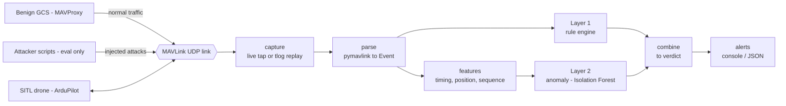
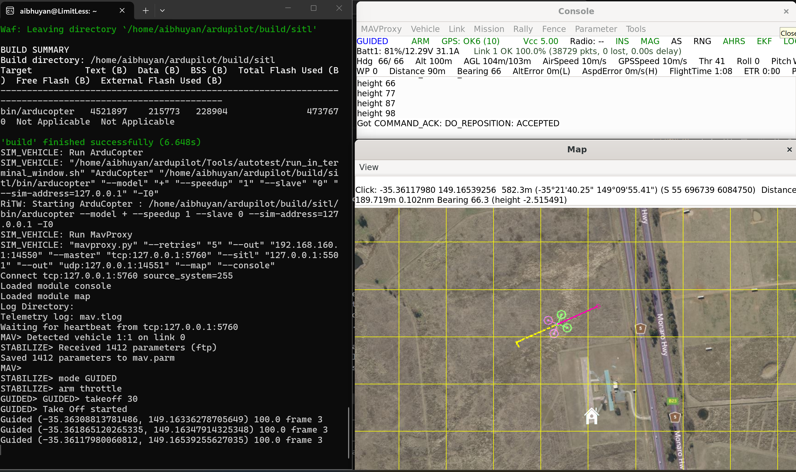
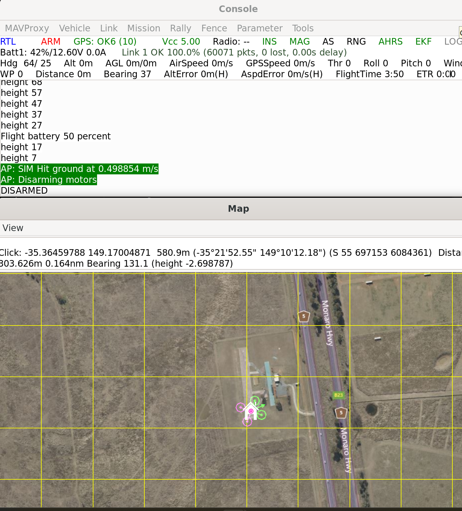

# MAVLink IDS — Intrusion Detection for Drone Command & Control

A passive, software-only **intrusion-detection system** for the MAVLink protocol
that drones speak to their ground stations. It watches the command-and-control
(C2) link between a Ground Control Station and a **simulated** drone
(ArduPilot SITL), and flags malicious or anomalous commands — command injection,
spoofing, replay, denial-of-service — in real time, with an explainable reason
for every alert.

> **Status:** Working two-layer IDS, built and measured end to end. Layer 1
> (rules) catches command injection, parameter tampering, and replay with **zero
> false positives** on a real benign flight; Layer 2 (an Isolation Forest anomaly
> detector) adds GPS-spoof detection, lifting recall from **75% to 100%**. Next:
> more benign flights and a train/test split to firm up the false-positive rate.

> **Safety:** Everything is passive, simulated, and localhost-only. Nothing
> transmits over radio, targets a real aircraft, or touches a network I don't
> own. The included attack script refuses to run against any non-localhost host.

---

## Why this matters

MAVLink is the C2 and telemetry protocol used by the two dominant open-source
autopilots, ArduPilot and PX4. Its security posture is weak by design:

- **v1** has no authentication and no encryption — cleartext. Anyone who can put
  packets on the link can inject commands.
- **v2** adds *optional* message signing, but no encryption; adoption is limited
  and it has documented weaknesses (brute-forceable keys, replay windows).

So command injection, GPS spoofing, parameter tampering, and replay are realistic
threats against real aircraft. This project detects attacks carried *over the
drone's own control protocol* — the layer above raw RF detection.

---

## Architecture



Data flows left to right; each stage is one package under `src/mavlink_ids/`:

- **capture** (`capture/`) — replay a saved `.tlog` for repeatable runs, or tap a
  live UDP link.
- **parse** (`parse/decoder.py`) — `pymavlink` decodes bytes into normalized
  `Event` records (who sent it, what type, when, was it signed, the payload).
- **features** (`features/extract.py`) — turn each event into a numeric vector
  (inter-message timing, position jumps, sequence gaps) for the model.
- **detect** (`detect/`) — Layer 1 rules (`rules.py`) read events, Layer 2 anomaly
  (`anomaly.py`) reads features, and `engine.py` unions them into one verdict.
- **alert** (`alert/sink.py`) — explainable console output and JSON Lines for the
  eval harness.

### The lab in action

ArduPilot SITL flying a GUIDED mission, viewed through MAVProxy's map and status
console — the simulated drone that generates all the traffic the IDS analyses
(the magenta track is the flight path):



A normal Return-To-Launch landing — the console reports touchdown at **0.5 m/s**
and disarms. This is the benign baseline the detector must *not* alarm on
(contrast the 14.7 m/s forced-disarm crash in the results below):



## Detection: two layers on purpose

**Layer 1 — signature / rule engine** (implemented). Deterministic,
high-precision, explainable. Each rule returns a plain-language reason a human
operator can act on. Current rules: a command from an unexpected system id (rogue
GCS); a disarm command — flagged **critical** when it carries the "force" flag
that bypasses the in-flight safety check; and a replay (an exact-duplicate
command re-sent on the link).

**Layer 2 — anomaly / ML** (implemented). An Isolation Forest trained only on
normal flight learns the usual range of the features (timing, position jumps,
sequence gaps) and flags deviations the rules miss — notably GPS spoofing, caught
as an impossible position jump.

The tradeoff, stated plainly: **rules give precision and explainability; the ML
layer gives coverage of novel or subtle attacks.** Using both — and knowing why —
is the point.

---

## Quick start

**Requirements:** Python 3.12+ and [uv](https://docs.astral.sh/uv/). To generate
your own captures you also need ArduPilot SITL — see
[`lab/run_sitl.md`](lab/run_sitl.md) for the full lab setup (WSL2 + ArduPilot).

**Install and test:**

```bash
git clone https://github.com/aibhuyan/mavlink-ids.git
cd mavlink-ids
uv sync                 # create the environment from the locked dependencies
uv run pytest -q        # run the test suite
```

**Get a capture.** Recorded flights (`.tlog`) live under `data/` and are
git-ignored (large, regenerable). Follow [`lab/run_sitl.md`](lab/run_sitl.md) to
fly a mission and save it to `data/benign/`.

**Run the detector over a capture:**

```python
from mavlink_ids.capture.replay import replay_file
from mavlink_ids.detect.rules import RuleEngine
from mavlink_ids.alert.sink import ConsoleSink

engine = RuleEngine()
sink = ConsoleSink()
for _ in engine.run(replay_file("data/benign/benign_flight_01.tlog"), sink):
    pass  # alerts print to the console as they fire
```

A single-command CLI (`uv run mavlink-ids <capture>`) is on the roadmap.

---

## Threat model

The attacks this system targets, all carried over the MAVLink C2 link:

| Attack | MAVLink mechanism | Impact | What gives it away |
|---|---|---|---|
| Command injection | `COMMAND_LONG` (arm/disarm, mode, RTL) | Vehicle hijack / crash | Command from an unexpected sysid; disarm mid-flight |
| GPS spoofing | Injected `GPS_INPUT` / falsified position | Flies to wrong place | Position jump beyond physical limits; velocity discontinuity |
| Parameter tampering | `PARAM_SET` on safety params | Disabled failsafes | Writes to critical params; unusual param traffic |
| Mission tampering | `MISSION_ITEM` rewrite | Altered flight path | Mid-flight mission changes from a new source |
| Replay | Re-sent valid packets | Repeated stale commands | Duplicate sequences/timestamps |
| GCS spoofing | Rogue system/component id | Unauthorized control | A second GCS appears; unexpected sysid/compid |
| DoS | `HEARTBEAT` flood, `RC_OVERRIDE` spam | Link saturation | Message-rate spikes; many sources |

## Results

**Dataset:** one real benign flight from ArduPilot SITL (**99,930 events**) with
**4 attacks** injected at known times — command injection, parameter tampering,
GPS spoofing, and replay.

**Baseline vs. improved:**

| Detector | Recall | Precision | FPR | F1 |
|---|---|---|---|---|
| Layer 1 — rules only | 75% | 100% | 0.000 | 0.857 |
| Layer 1 + Layer 2 — rules + anomaly | **100%** | 80% | 0.00001 | 0.889 |

**Per-attack detection:**

| Attack | Rules | Rules + anomaly |
|---|---|---|
| Command injection (forced disarm) | ✅ | ✅ |
| Parameter tampering (`PARAM_SET`) | ✅ | ✅ |
| Replay (duplicated command) | ✅ | ✅ |
| GPS spoofing (`GPS_INPUT` jump) | ❌ | ✅ |

The rule engine catches command-style attacks and replay with **perfect precision
and zero false positives**, but is blind to GPS spoofing (it's telemetry, not a
command). The **anomaly layer** — an Isolation Forest trained only on normal
flight — catches the GPS spoof as an extreme position jump, lifting recall from
**75% → 100%** while holding false positives to a single event (FPR 0.001%).
Detection is immediate (0-message latency).

> **Honest caveat:** these numbers come from a *single* benign flight, with the
> anomaly threshold tuned on that same flight — so the false-positive rate is
> optimistic. Multiple benign flights and a proper train/test split are the next
> step for a robust estimate.

> The attacks are real, not theoretical: injecting a forced disarm dropped the
> simulated drone from a hover to a **14.7 m/s** ground impact, versus a normal
> **0.5 m/s** landing.

Reproduce: `uv run python evals/make_dataset.py && uv run python evals/run_suite.py`

## Roadmap

- [x] MAVLink parser → normalized events
- [x] Simulation lab (ArduPilot SITL) + benign capture
- [x] Eval-only attack script (command injection)
- [x] Layer 1 rule engine + explainable alerts
- [x] Labeled dataset (benign flight + 4 attack types)
- [x] Eval harness: recall / precision / F1 / FPR / latency + per-attack recall
- [x] Layer 2 anomaly / ML detector (Isolation Forest)
- [ ] More benign flights + train/test split for a robust FPR
- [ ] CLI and a small alert-timeline dashboard

## Tech

Python 3.12 · [uv](https://docs.astral.sh/uv/) · [pymavlink](https://github.com/ArduPilot/pymavlink) · [scikit-learn](https://scikit-learn.org/) · ArduPilot SITL · pytest

## Safety & scope

This is a **defensive** project. The attack scripts exist only to test the
detector against a **simulated** drone on localhost, and they refuse to run
against any non-localhost target. Nothing transmits over radio, targets a real
aircraft, or touches a network I don't own.
